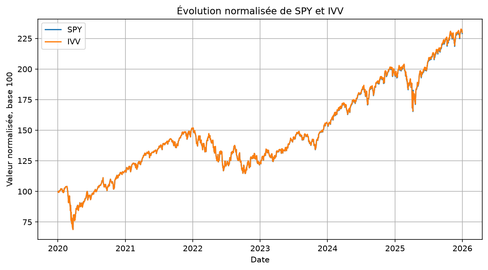
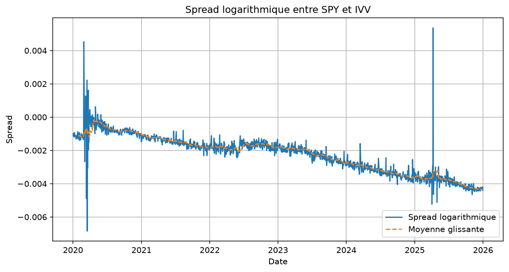
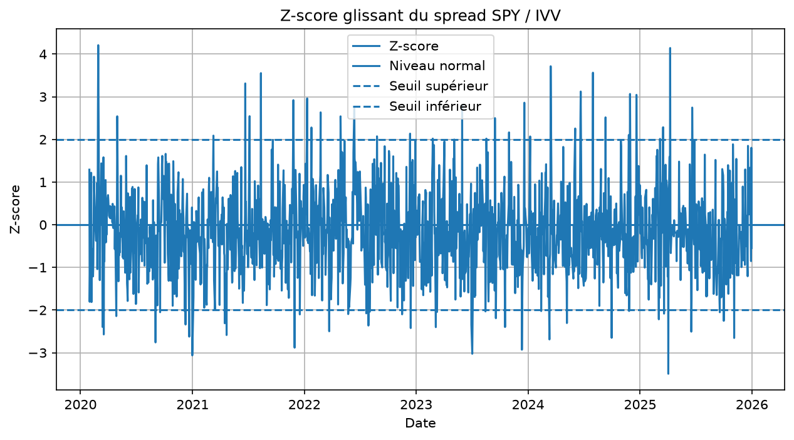
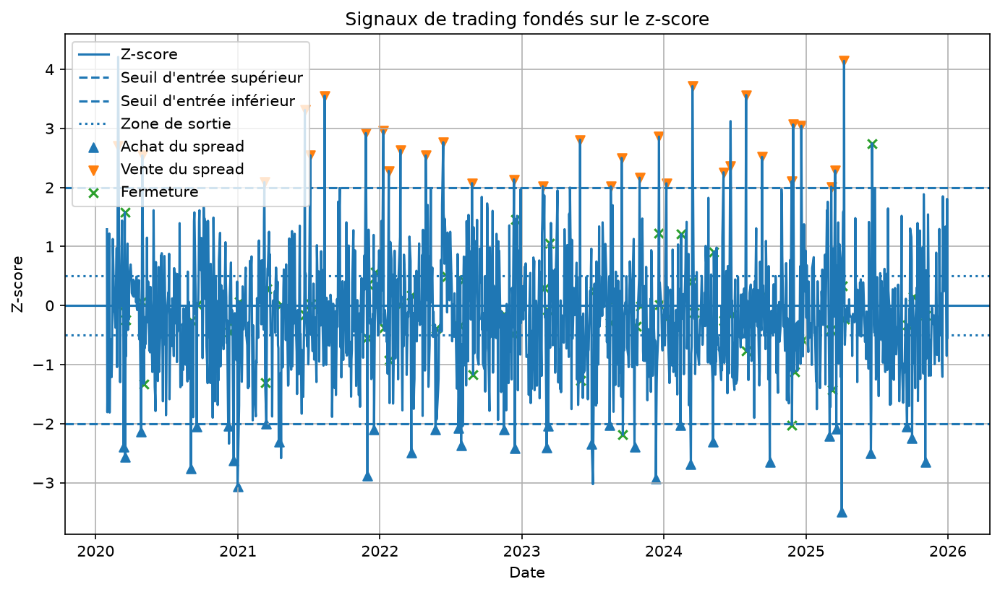
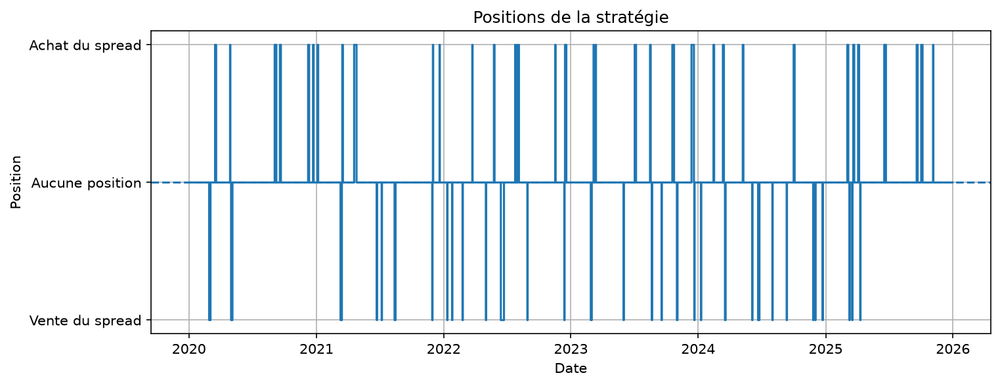
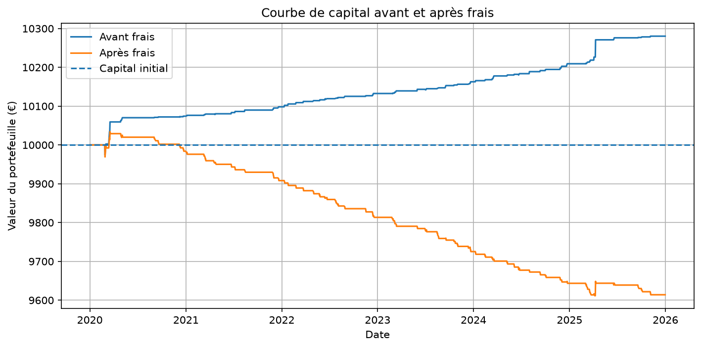
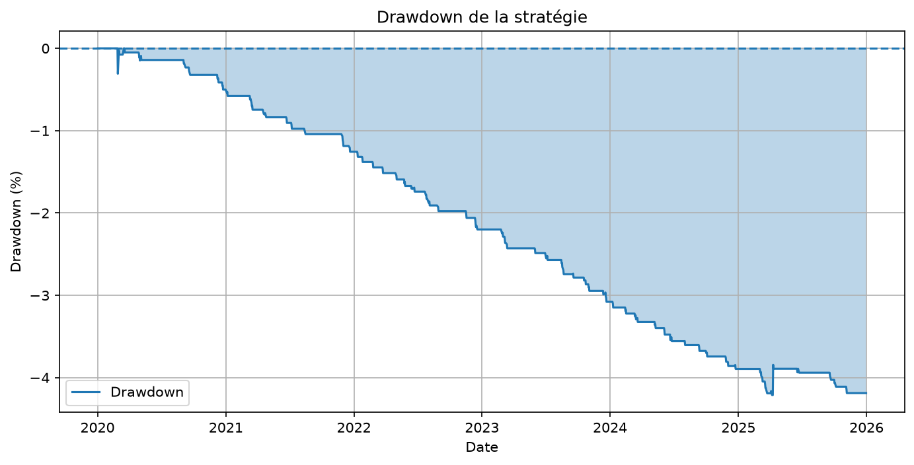

# Mean-Reversion Backtest

Backtest pédagogique d’une stratégie de retour à la moyenne appliquée à une paire d’ETF suivant le S&P 500 : SPY et IVV.

Le projet couvre l’ensemble du processus :

- téléchargement et nettoyage des données ;
- construction d’un spread ;
- calcul d’un z-score glissant ;
- génération de signaux de trading ;
- calcul des rendements et du PnL ;
- prise en compte des frais de transaction ;
- gestion du risque avec un stop-loss ;
- calcul de mesures de performance.

## Objectif du projet

L’objectif est d’étudier une stratégie de pair trading fondée sur l’idée suivante :

```text
SPY et IVV suivent tous les deux le S&P 500.

Leurs évolutions sont donc normalement très proches.

Lorsqu’un écart inhabituel apparaît entre les deux ETF,
la stratégie suppose que cet écart peut revenir vers son niveau habituel.
```

Ce projet est principalement pédagogique. Il permet de comprendre la construction d’un backtest et ses limites.

Un bon résultat historique ne garantit pas qu’une stratégie fonctionnera dans le futur.

## SPY et IVV

SPY et IVV sont deux ETF américains qui cherchent à reproduire la performance du S&P 500.

Un ETF est un fonds coté en Bourse. Il contient un panier d’actions, mais peut être acheté ou vendu comme une action classique.

Les deux ETF possèdent donc des portefeuilles très proches, composés de grandes entreprises américaines.

Cependant, leur prix par part n’est pas exactement identique. Il n’est donc pas pertinent d’étudier directement :

```text
SPY - IVV
```

Une différence brute peut varier uniquement parce que les deux actifs n’ont pas la même échelle de prix.

## Structure du projet

```text
mean-reversion-backtest/
├── data/
│   ├── prices.csv
│   ├── spread_zscore.csv
│   ├── signals.csv
│   ├── risk_positions.csv
│   └── backtest_results.csv
│
├── figures/
│   ├── normalized_prices.png
│   ├── spread.png
│   ├── zscore.png
│   ├── trading_signals.png
│   ├── positions.png
│   ├── daily_strategy_returns.png
│   ├── equity_curve.png
│   ├── equity_curve_with_costs.png
│   └── drawdown.png
│
├── src/
│   ├── __init__.py
│   ├── spread.py
│   ├── signals.py
│   ├── backtest.py
│   ├── metrics.py
│   └── risk.py
│
├── download_data.py
├── spread_demo.py
├── signals_demo.py
├── risk_demo.py
├── backtest_demo.py
├── requirements.txt
├── .gitignore
└── README.md
```

Les fichiers CSV du dossier `data/` sont générés automatiquement par les scripts et ne sont pas nécessairement publiés sur GitHub.

## Installation

Créer un environnement virtuel :

```powershell
python -m venv .venv
```

Sous PowerShell, il peut être nécessaire d’autoriser temporairement l’exécution des scripts :

```powershell
Set-ExecutionPolicy -Scope Process -ExecutionPolicy RemoteSigned
```

Activer ensuite l’environnement :

```powershell
.\.venv\Scripts\Activate.ps1
```

Installer les bibliothèques :

```powershell
python -m pip install -r requirements.txt
```

Les principales dépendances sont :

```text
numpy
pandas
matplotlib
yfinance
```

## Ordre d’exécution

Les scripts doivent être exécutés dans l’ordre suivant :

```powershell
python download_data.py
python spread_demo.py
python signals_demo.py
python risk_demo.py
python backtest_demo.py
```

Chaque étape utilise les résultats produits par l’étape précédente.

---

# 1. Téléchargement des données

Le script :

```text
download_data.py
```

télécharge les prix historiques de SPY et IVV avec `yfinance`.

Les données utilisées sont les prix de clôture ajustés.

Le programme vérifie notamment :

- que les données ont bien été téléchargées ;
- que les colonnes SPY et IVV sont présentes ;
- qu’il n’existe pas de dates dupliquées ;
- qu’il n’existe pas de valeurs manquantes après nettoyage ;
- que les dates sont classées dans l’ordre chronologique.

Les prix nettoyés sont enregistrés dans :

```text
data/prices.csv
```

## Normalisation des prix

Pour comparer graphiquement les deux actifs, leurs prix sont normalisés avec une base 100.

Le calcul est :

```text
prix normalisé à la date t
=
100 × prix à la date t / premier prix observé
```

Exemple :

```text
Prix initial : 200
Prix actuel  : 240

Prix normalisé
=
100 × 240 / 200
=
120
```

Une valeur normalisée de 120 correspond donc à une progression de 20 % depuis le début de la période.

Le graphique obtenu est enregistré dans :

```text
figures/normalized_prices.png
```



---

# 2. Construction du spread

Le spread utilisé est le logarithme du ratio entre SPY et IVV.

```text
spread
=
log(SPY / IVV)
```

Cette expression est équivalente à :

```text
spread
=
log(SPY) - log(IVV)
```

## Interprétation

```text
Le spread augmente
→ SPY devient relativement plus haut par rapport à IVV

Le spread diminue
→ SPY devient relativement plus bas par rapport à IVV
```

Le logarithme permet de comparer les variations relatives des deux actifs sans être perturbé par leur différence d’échelle.

Le calcul est réalisé dans :

```text
src/spread.py
```

Le script :

```text
spread_demo.py
```

enregistre les résultats dans :

```text
data/spread_zscore.csv
```

Le spread et sa moyenne glissante sont représentés dans :

```text
figures/spread.png
```



---

# 3. Z-score glissant

Une valeur du spread n’est pas directement interprétable sans connaître son comportement récent.

Le z-score mesure la distance entre le spread actuel et sa moyenne récente.

```text
z-score
=
(spread actuel - moyenne glissante)
/
écart-type glissant
```

Une fenêtre de 20 jours de Bourse est utilisée.

## Interprétation

```text
z-score proche de 0
→ le spread est proche de son niveau récent habituel

z-score positif
→ SPY est relativement haut par rapport à IVV

z-score négatif
→ SPY est relativement bas par rapport à IVV

z-score supérieur à 2
→ écart positif considéré comme important

z-score inférieur à -2
→ écart négatif considéré comme important
```

Le graphique est enregistré dans :

```text
figures/zscore.png
```



Un z-score élevé ne garantit pas que le spread reviendra ensuite vers sa moyenne. Il indique uniquement que l’écart est inhabituel par rapport à la fenêtre récente.

---

# 4. Règles de trading

Les signaux sont générés dans :

```text
src/signals.py
```

Trois positions sont possibles :

```text
+1 = acheter le spread
 0 = ne détenir aucune position
-1 = vendre le spread
```

## Achat du spread

Lorsque :

```text
z-score <= -2
```

la stratégie considère que SPY est relativement bas par rapport à IVV.

Elle prend alors la position suivante :

```text
acheter SPY
vendre IVV
```

La position est représentée par :

```text
+1
```

## Vente du spread

Lorsque :

```text
z-score >= 2
```

la stratégie considère que SPY est relativement haut par rapport à IVV.

Elle prend alors la position suivante :

```text
vendre SPY
acheter IVV
```

La position est représentée par :

```text
-1
```

## Fermeture de la position

La position est fermée lorsque le z-score revient suffisamment près de zéro.

Le seuil de sortie est fixé à :

```text
0,5
```

Pour une position longue :

```text
fermeture lorsque le z-score devient supérieur ou égal à -0,5
```

Pour une position courte :

```text
fermeture lorsque le z-score devient inférieur ou égal à 0,5
```

Fermer une position signifie effectuer les opérations inverses afin de revenir à une exposition nulle.

## Décalage des signaux

Le signal du jour est calculé avec le prix de clôture du jour.

Il ne peut donc être appliqué qu’à partir du jour suivant.

Le programme utilise :

```python
position = target_position.shift(1)
```

Ce décalage empêche d’utiliser une information qui n’était pas encore disponible au moment de la prise de position.

Il permet d’éviter un biais appelé :

```text
look-ahead bias
```

Les signaux sont enregistrés dans :

```text
data/signals.csv
```

Les graphiques associés sont :

```text
figures/trading_signals.png
figures/positions.png
```





---

# 5. Calcul des rendements

Le rendement quotidien d’un actif est calculé avec :

```text
rendement à la date t
=
prix à la date t / prix à la date t-1 - 1
```

Exemple :

```text
Prix précédent : 100
Prix actuel    : 102

Rendement
=
102 / 100 - 1
=
0,02
=
2 %
```

Le rendement d’une position longue sur le spread est :

```text
rendement du spread
=
rendement de SPY - rendement d’IVV
```

## Pondération du portefeuille

La stratégie utilise une pondération de 50 % sur chaque jambe.

Pour une position longue :

```text
+50 % du capital sur SPY
-50 % du capital sur IVV
```

Pour une position courte :

```text
-50 % du capital sur SPY
+50 % du capital sur IVV
```

Le rendement brut de la stratégie est donc :

```text
rendement brut
=
0,5 × position × rendement du spread
```

La stratégie possède une exposition nette proche de zéro :

```text
+50 % - 50 % = 0 %
```

Elle cherche ainsi à gagner sur la différence de performance entre les deux ETF plutôt que sur la direction générale du marché.

---

# 6. Frais de transaction

Les frais de transaction sont modélisés avec un coût fixe exprimé en points de base.

L’hypothèse utilisée est :

```text
5 points de base par montant échangé
```

Un point de base correspond à :

```text
1 point de base = 0,01 % = 0,0001
```

Donc :

```text
5 points de base = 0,05 % = 0,0005
```

Les coûts peuvent représenter :

- les commissions ;
- le bid-ask spread ;
- un impact de marché simplifié.

## Turnover

Le turnover mesure le montant échangé relativement au capital.

Passage de zéro à une position :

```text
0 → +1
ou
0 → -1

turnover = 100 % du capital
```

Fermeture d’une position :

```text
+1 → 0
ou
-1 → 0

turnover = 100 % du capital
```

Inversion directe :

```text
+1 → -1
ou
-1 → +1

turnover = 200 % du capital
```

Le rendement après frais est :

```text
rendement net
=
rendement brut - frais de transaction
```

Le projet compare donc deux courbes de capital :

```text
courbe avant frais
courbe après frais
```

Le graphique est enregistré dans :

```text
figures/equity_curve_with_costs.png
```



---

# 7. Gestion du risque

La gestion du risque est réalisée dans :

```text
src/risk.py
```

Elle comprend :

- une limite de position ;
- un stop-loss ;
- un blocage temporaire après un stop-loss.

## Limite de position

Les positions sont limitées à l’intervalle :

```text
-1 <= position <= 1
```

Cette limite empêche le programme de prendre une exposition supérieure à la taille maximale prévue.

## Stop-loss

Le stop-loss est fixé à :

```text
0,5 % du capital
```

Lorsqu’un trade accumule une perte d’au moins 0,5 %, le stop-loss est déclenché.

Le stop est vérifié à la fin de la journée. La fermeture de la position devient donc effective à partir du jour suivant.

Le stop-loss ne garantit pas l’absence de pertes. Il limite uniquement la durée d’exposition à un trade qui évolue défavorablement.

## Blocage après le stop-loss

Après le déclenchement du stop-loss, la stratégie ne reprend pas immédiatement la même position.

Elle attend que le signal initial revienne à zéro avant d’autoriser un nouveau trade.

Cela évite le comportement suivant :

```text
stop-loss déclenché
→ fermeture
→ réouverture immédiate du même trade
→ nouveau stop-loss
```

Les positions après gestion du risque sont enregistrées dans :

```text
data/risk_positions.csv
```

---

# 8. Courbe de capital

La courbe de capital représente l’évolution d’un capital initial normalisé à 1.

```text
equity curve = 1,00
→ capital inchangé

equity curve = 1,10
→ gain de 10 %

equity curve = 0,95
→ perte de 5 %
```

Les rendements sont composés dans le temps.

```text
courbe de capital
=
produit cumulé de (1 + rendement quotidien)
```

Pour un capital initial de 10 000 euros :

```text
valeur du portefeuille
=
10 000 × equity curve
```

---

# 9. Mesures de performance

Les mesures sont calculées dans :

```text
src/metrics.py
```

## Rendement total

Le rendement total mesure la variation du capital entre le début et la fin du backtest.

```text
rendement total
=
capital final / capital initial - 1
```

Le projet calcule le rendement :

```text
avant frais
après frais
```

## Rendement annualisé

Le rendement annualisé transforme la performance totale en rendement moyen équivalent par année.

Il permet de comparer des backtests ayant des durées différentes.

## Volatilité annualisée

La volatilité mesure la variabilité des rendements quotidiens.

```text
volatilité annualisée
=
écart-type quotidien × racine carrée de 252
```

Le nombre 252 représente approximativement le nombre de jours de Bourse dans une année.

Une forte volatilité indique que les résultats quotidiens sont très irréguliers.

## Sharpe ratio

Le Sharpe ratio compare le rendement moyen au risque pris.

Dans ce projet, le taux sans risque est supposé nul.

```text
Sharpe ratio
=
rendement quotidien moyen
/
volatilité quotidienne
× racine carrée de 252
```

Un Sharpe élevé indique que la stratégie obtient davantage de rendement relativement à ses fluctuations.

Un Sharpe négatif indique que le rendement moyen est négatif.

Le Sharpe ratio ne résume cependant pas tous les risques, notamment les événements rares et les pertes extrêmes.

## Drawdown

Le drawdown mesure la perte du portefeuille par rapport à son précédent sommet.

```text
drawdown
=
valeur actuelle / plus haute valeur passée - 1
```

Exemple :

```text
Sommet précédent : 110
Valeur actuelle  : 99

Drawdown
=
99 / 110 - 1
=
-10 %
```

Le maximum drawdown correspond à la pire baisse observée pendant tout le backtest.

Le graphique est enregistré dans :

```text
figures/drawdown.png
```



## Temps passé en position

Cette mesure représente la proportion des journées pendant lesquelles la stratégie possède une position ouverte.

```text
temps en position
=
nombre de journées avec une position non nulle
/
nombre total de journées
```

---

# 10. Résultats

Le script final :

```text
backtest_demo.py
```

affiche notamment :

```text
capital initial
capital final avant frais
capital final après frais
impact des frais
rendement total avant frais
rendement total après frais
rendement annualisé
volatilité annualisée
Sharpe ratio
drawdown maximum
temps passé en position
nombre d’entrées
nombre de sorties
```

Les résultats détaillés sont enregistrés dans :

```text
data/backtest_results.csv
```

Les résultats numériques dépendent :

- de la période téléchargée ;
- de la fenêtre glissante ;
- des seuils d’entrée et de sortie ;
- des coûts de transaction ;
- du stop-loss ;
- des données renvoyées par Yahoo Finance.

---

# 11. Limites du projet

Ce backtest constitue une première approche pédagogique. Il possède plusieurs limites importantes.

## Résultats historiques

Le backtest utilise des données passées.

Un PnL historique positif ne garantit pas un PnL positif dans le futur.

Le passé sert uniquement à vérifier si une hypothèse semble cohérente avec les données déjà observées.

## Absence de séparation entraînement-test

Les mêmes données sont utilisées pour construire et évaluer la stratégie.

Une analyse plus rigoureuse devrait séparer :

```text
période d’entraînement
→ choix des paramètres

période de test
→ évaluation sur des données non utilisées
```

Cela permettrait de limiter le surapprentissage.

## Paramètres fixes

Les paramètres sont choisis à l’avance :

```text
fenêtre du z-score : 20 jours
seuil d’entrée     : 2
seuil de sortie    : 0,5
stop-loss          : 0,5 %
frais              : 5 points de base
```

Le projet n’étudie pas encore la sensibilité des résultats à ces paramètres.

## Spread simplifié

Le spread est construit avec :

```text
log(SPY) - log(IVV)
```

Une méthode plus avancée pourrait estimer un hedge ratio statistique :

```text
log(SPY) - beta × log(IVV)
```

## Pondération fixe

Chaque jambe reçoit un poids de 50 %.

Le projet ne prend pas en compte :

- les différences de volatilité ;
- un hedge ratio dynamique ;
- une allocation optimisée ;
- un effet de levier variable.

## Exécution simplifiée

Le programme suppose que les positions peuvent être prises sans difficulté aux prix utilisés dans le backtest.

Il ne modélise pas précisément :

- le prix bid et le prix ask ;
- la liquidité disponible ;
- le slippage réel ;
- les délais d’exécution ;
- les contraintes de vente à découvert ;
- les coûts d’emprunt des titres.

## Stabilité de la relation

SPY et IVV suivent le même indice, mais leur relation peut évoluer.

Une forte corrélation passée ne garantit pas que leur spread restera toujours stable.

## Paire très proche

Les écarts entre SPY et IVV sont généralement très faibles.

Les frais de transaction peuvent donc absorber une partie importante des gains bruts.

La paire est particulièrement adaptée à l’apprentissage, mais pas nécessairement à la construction d’une stratégie réellement rentable.

---

# 12. Améliorations possibles

Plusieurs extensions pourraient être ajoutées :

```text
séparation in-sample et out-of-sample
walk-forward analysis
estimation d’un hedge ratio
test de stationnarité
test de cointégration
analyse de sensibilité des paramètres
comparaison de plusieurs paires
calcul des performances par trade
durée moyenne des trades
win rate
gain moyen et perte moyenne
prise en compte du slippage
coûts de vente à découvert
paper trading
```

Ces éléments ne sont pas nécessaires au fonctionnement de la version actuelle.

---

# 13. Compétences travaillées

Ce projet permet de pratiquer :

- Python ;
- NumPy ;
- Pandas ;
- Matplotlib ;
- téléchargement de données financières ;
- manipulation de séries temporelles ;
- rendements quotidiens ;
- spread et z-score ;
- génération de signaux ;
- backtesting ;
- détection du look-ahead bias ;
- gestion des positions ;
- calcul du PnL ;
- frais de transaction ;
- stop-loss ;
- volatilité ;
- Sharpe ratio ;
- drawdown ;
- structuration d’un projet ;
- Git et GitHub.

---

# 14. Avertissement

Ce projet a une vocation exclusivement éducative.

Il ne constitue pas un conseil financier ni une recommandation d’investissement.

Les résultats historiques ne permettent pas de garantir les performances futures.
